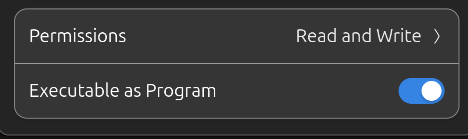

# Grok Bot for Linux (unofficial)

xAI ships Grok Bot for Windows and macOS only. This repository builds a
**wine-less** Linux package (AppImage, tarball, optional `.deb`).

It is a packaging project, not an official xAI or Cursor product. Grok Bot
itself remains proprietary.

**Download:** [Releases](https://github.com/atavacron/grok-bot-linux/releases/latest)

Current packaged version: **0.30.0**. String audit of the AppImage
(including the words “spock” and “aurora”):
[docs/string-audit.md](docs/string-audit.md).

To rebuild it yourself, paste [BUILD-PROMPT.md](BUILD-PROMPT.md) into a new
Grok Build session (or run `./scripts/port.sh <version>` from this repo).

**Warning:** the AppImage always launches Chromium with `--no-sandbox`. That
flag is built into `AppRun`; you do not pass it, and you cannot turn it off
by omitting it. Renderer processes then run with your user privileges. Use
the tarball with a setuid `chrome-sandbox` if you want the sandbox.

This build is **x86_64** (64-bit Intel/AMD) and needs **glibc 2.38 or newer**.

**Should work on:** Ubuntu 24.04 / 25.04 / 26.04, Linux Mint 22, Pop!_OS 24.04,
Fedora 40+, Arch Linux, Debian 13, openSUSE Tumbleweed, and other current
glibc desktop distros.

**Will not work on:** Ubuntu 22.04, Debian 12, RHEL/Rocky/Alma 9, Alpine
(musl), or ARM (Raspberry Pi, Apple Silicon VMs, aarch64).

## Install

### AppImage (easiest)

Make it executable, then run it:

```bash
chmod +x Grok_Bot_*.AppImage
./Grok_Bot_*.AppImage
```

Or in the file manager: right-click the AppImage → **Properties** →
**Permissions** → turn on **Executable as Program**.



Needs FUSE (`/dev/fuse`). If FUSE is missing:

```bash
chmod +x Grok_Bot_*.AppImage
./Grok_Bot_*.AppImage --appimage-extract
./squashfs-root/AppRun
```

If another Grok Bot is already running, quit it first. Every build uses the
same Electron app id (`sand`) and will otherwise just focus the old window.

### Tarball (sandbox-capable)

The AppImage cannot ship a setuid `chrome-sandbox`. Use the tarball if you
want the Chromium sandbox:

```bash
tar -xzf Grok_Bot_0.30.0_linux_x64.tar.gz
cd Grok_Bot_0.30.0_linux_x64
sudo chown root:root chrome-sandbox && sudo chmod 4755 chrome-sandbox
./grok-bot
```

Without the setuid sandbox:

```bash
./grok-bot --no-sandbox
```

### Debian package (optional)

```bash
sudo dpkg -i grok-bot_0.30.0_amd64.deb
```

## How it works

The Windows installer is an NSIS archive. Inside it is `app-64.7z`, which holds
a normal Electron application tree.

| From the Windows build | On Linux |
| --- | --- |
| `resources/app.asar` (JavaScript) | Copied **unchanged** |
| `resources/app.asar.unpacked/**/*.js` | Copied unchanged |
| `Grok Bot.exe`, `*.dll` | **Not used** — replaced by official Electron linux-x64 |
| `*.node` native addons | **Cannot be reused** — they are Windows PE (`MZ`) binaries. `dlopen` on Linux only loads ELF. Rebuilt or swapped for Linux prebuilds. |

So the “app core” (the asar) *is* used without change. The Windows executable
and native addons are not portable; those are the only pieces we replace.

Native addons in 0.30.0 (from the Windows `runtime-deps-manifest.json`):

- `cursor-proclist` — Linux `/proc` implementation (Windows tree ships the JS wrapper, not the `.cc` files)
- `tree-sitter`, `tree-sitter-bash` — npm linux-x64 prebuilds
- `web-tree-sitter` — WASM, copied unchanged

0.24.0 also shipped `better-sqlite3`, `whichlang-node`, and `@anysphere/tree-chunk-napi`. Those modules are gone from the 0.29+ payload, so they are not rebuilt. Hardware WebAuthn uses a Windows-only `sand-webauthn-signer.exe`; Linux looks for `sand-webauthn-signer` and will skip that helper if it is missing.

## Build locally

Needs Node.js 22+, `curl`, `unzip`, `g++`, `make`, `python3`, and either
`7z`/`p7zip-full` or network access (the script will fetch a standalone 7-Zip).
AppImage output also needs `squashfs-tools` and `appimagetool`.

```bash
./scripts/detect-version.sh          # HEAD-probe for a newer installer
./scripts/port.sh 0.30.0             # local originals/ or download, fuse, rebuild, package
```

Artifacts land in `dist/`:

- `Grok_Bot_<ver>_linux_x64.tar.gz`
- `Grok_Bot_<ver>_x86_64.AppImage` (when AppImage tooling is present)
- `grok-bot_<ver>_amd64.deb` (when `dpkg-deb` is present)

Override Electron with `--electron-version` / `--electron-abi`. Downloads are
cached in `.cache/`.

### Rebuild with Grok Build

Paste the full prompt in [BUILD-PROMPT.md](BUILD-PROMPT.md) into a new Grok
Build session. If `originals/Grok_Bot_<ver>_Setup.exe` is present, `port.sh`
uses that file instead of downloading.

## Troubleshooting

| Symptom | Fix |
| --- | --- |
| `7z: command not found` | Install `p7zip-full`, or let `port.sh` download 7zz into `.cache/tools`. |
| `chrome-sandbox: Operation not permitted` | `sudo chown root:root chrome-sandbox && sudo chmod 4755 chrome-sandbox`, or pass `--no-sandbox`. |
| `invalid ELF header` / crash on `.node` | A Windows PE addon slipped through. Rebuild with `./scripts/port.sh <ver>` and do **not** set `GROKBOT_ALLOW_BROKEN_NATIVE=1`. |
| `node-gyp` fails on cursor-proclist | Need `g++`, `make`, and Python 3.12 (conda/pyenv Pythons 3.13+ can break node-gyp). |
| AppImage not produced | Install `squashfs-tools` and `appimagetool`. The tarball still builds. |
| Security-key / WebAuthn helper missing | Windows ships `sand-webauthn-signer.exe`. Linux looks for `sand-webauthn-signer` and will not find it. Password / browser login still works. |

## Issues

**Issues are welcome. Pull requests are not accepted.** GitHub always lets
people open a PR against a public repo; those PRs are closed automatically.
Please use [Issues](https://github.com/atavacron/grok-bot-linux/issues) for
bugs, questions, and distro reports.

## License

Scripts in this repository are available for reuse as packaging glue.

Grok Bot, its asar payload, and trademarks belong to xAI / Cursor. Do not
commit installer binaries or `app.asar` into this repo — they are downloaded
at build time.
